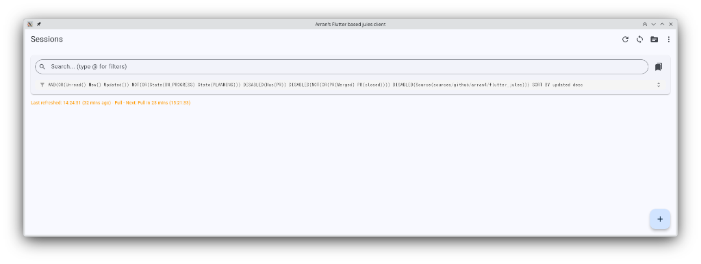
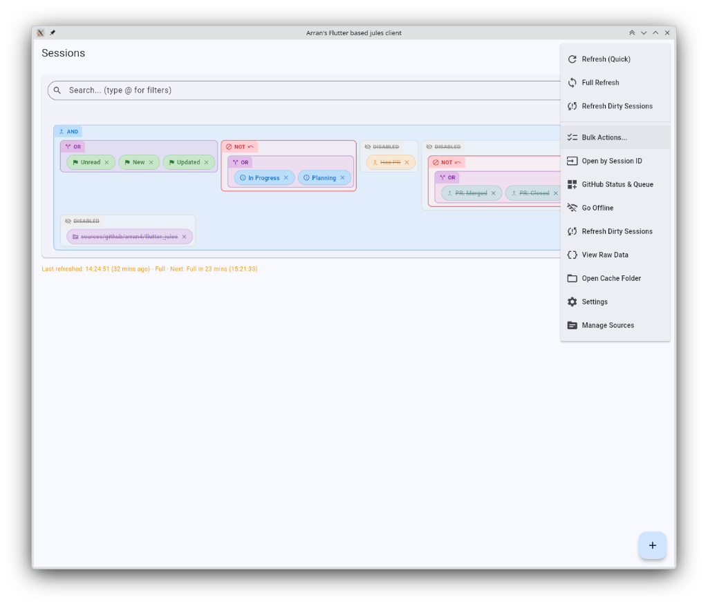
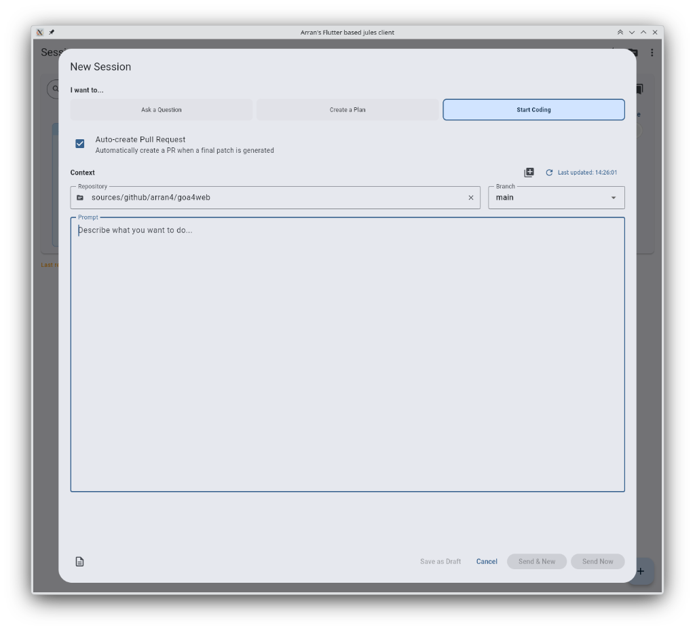
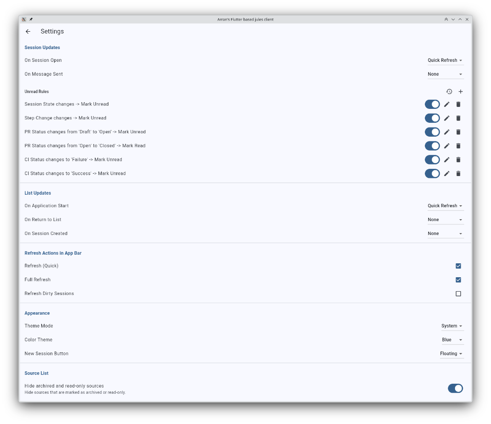
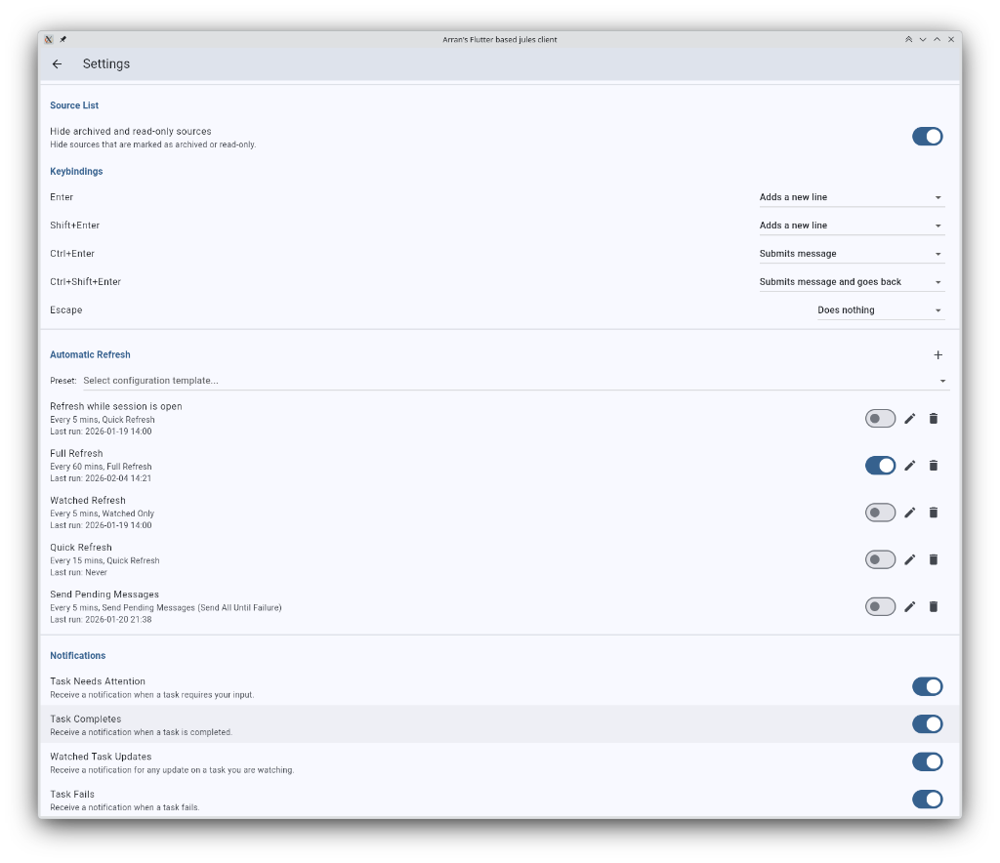
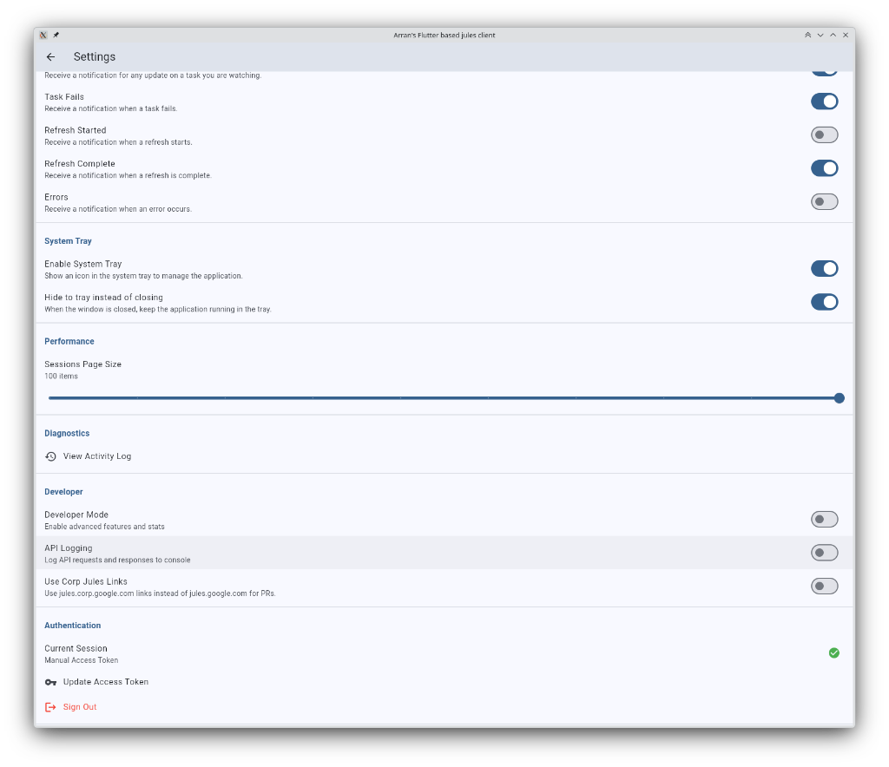

<p align="center">
  
</p>

# Arran's Flutter based jules client

A comprehensive Flutter-based client application for interacting with the Google Jules API. This application provides a robust, cross-platform interface for managing sessions, browsing sources, and collaborating with the Jules agent.

## Project Status

🚧 **Active Development**

This project is currently under active development. Features are being added and refined continuously.

## Features

### 🔐 Authentication & Security
- **Flexible Auth:** Supports both **API Key** (`X-Goog-Api-Key`) and **OAuth2 Bearer Token** authentication.
- **Secure Storage:** Credentials are encrypted and stored safely using `flutter_secure_storage`.
- **Privacy Masking:** Source titles are automatically masked (e.g., `*****`) for private sources to ensure confidentiality.

### 💬 Session Management & Chat
- **Rich Chat Interface:** Interactive message history with support for text and rich media.
- **Image Attachments:** Attach images to your prompts via URL. The client handles fetching and embedding them as base64 data.
- **Smart Creation:** Specialized dialog for creating sessions with specific modes:
    - **Question:** Standard Q&A.
    - **Plan:** Enforces a plan approval step (`requirePlanApproval`).
    - **Start Coding:** Automation mode triggering `AUTO_CREATE_PR`.
- **Plan Approval:** Built-in UI to review and approve execution plans directly within the chat stream.
- **Progress Tracking:** Real-time updates on long-running tasks, showing step-by-step progress.
- **Pagination:** Infinite scrolling implementation to seamlessly load session history.

### 📚 Source Exploration
- **Source Browser:** View and filter available resources the agent can access.
- **Context Integration:** Start new sessions directly from a source context.
- **Search:** Client-side filtering with strict substring matching.

### ⚡ Bulk Operations
- **Powerful Automation:** Perform complex sequences of actions across hundreds of sessions simultaneously.
- **Advanced Targeting:** Use the full power of the search and filter system to select target sessions.
- **Flexible Execution:**
    - **Parallelism:** Configure multiple concurrent queries to speed up processing.
    - **Dynamic Delays:** Adjust inter-job wait times (ms, s, min) in real-time.
    - **Execution Control:** Set limits, skip offsets, randomize orders, and toggle 'stop-on-error' behavior.
- **Real-time Monitoring:** Activity logs, progress bars, and estimated time remaining calculations keep you informed.
- **Action Sequencing:** Chain multiple operations (e.g., *Refresh -> Quick Reply -> Mark as Read*) for each session.

### ⚙️ Enhanced Settings  
- **Unread Rules:** Configure specific state changes (e.g., "PR Status to Open") to automatically mark sessions as unread.  
- **Smart Notifications:** Toggle system tray alerts for task updates, failures, or completions.  
- **Auto-Refresh:** Set intervals for quick or full refreshes to keep your dashboard in sync.  
- **System Tray:** Minimize the app to the tray to keep it running in the background.

## Screenshots

### Main Dashboard
The session list features a powerful query builder for filtering by status, tags, and properties.


### Compact Filters
Complex queries can be collapsed to save screen space while keeping the active filters visible.


### Main Menu
Quickly access bulk actions, refresh dirty sessions, or open sessions by ID.


### New Session
Launch new tasks with context, specific modes, and optional PR automation.


### Bulk Actions
Execute workflows across multiple sessions with advanced targeting and concurrency controls.


### Settings: Unread Rules
Define custom rules to automatically manage session read/unread states.


### Settings: Notifications & Refresh
Control how often the app syncs and when it should notify you.


### Settings: System
Manage system tray behavior, performance tweaks, and developer options.


## Setup & Development

### Prerequisites

- **Flutter SDK:** Latest Stable channel.
- **Dart SDK:** Included with Flutter.

#### Linux Requirements
If building on Linux, ensure the following system dependencies are installed:
```bash
sudo apt-get install clang cmake ninja-build pkg-config libgtk-3-dev libsecret-1-dev
```

### Running the App

**Desktop & Mobile:**
```bash
flutter run
```

### Building for Release

Release artifacts are generated in specific output directories. The CI pipeline automatically renames these for distribution.

| Platform | Build Command | Output Location |
|----------|---------------|-----------------|
| **Windows** | `flutter build windows` | `build/windows/x64/runner/Release` |
| **Linux** | `flutter build linux` | `build/linux/x64/release/bundle` |
| **macOS** | `flutter build macos` | `build/macos/Build/Products/Release/jules_client.app` |

### Code Quality & Testing

The project enforces strict code quality standards via CI:

- **Formatting:** Ensure code is formatted correctly.
    ```bash
    dart format .
    ```
- **Linting:** Analyze code for potential errors.
    ```bash
    flutter analyze
    ```
- **Testing:** Run unit and widget tests.
    ```bash
    flutter test
    ```
